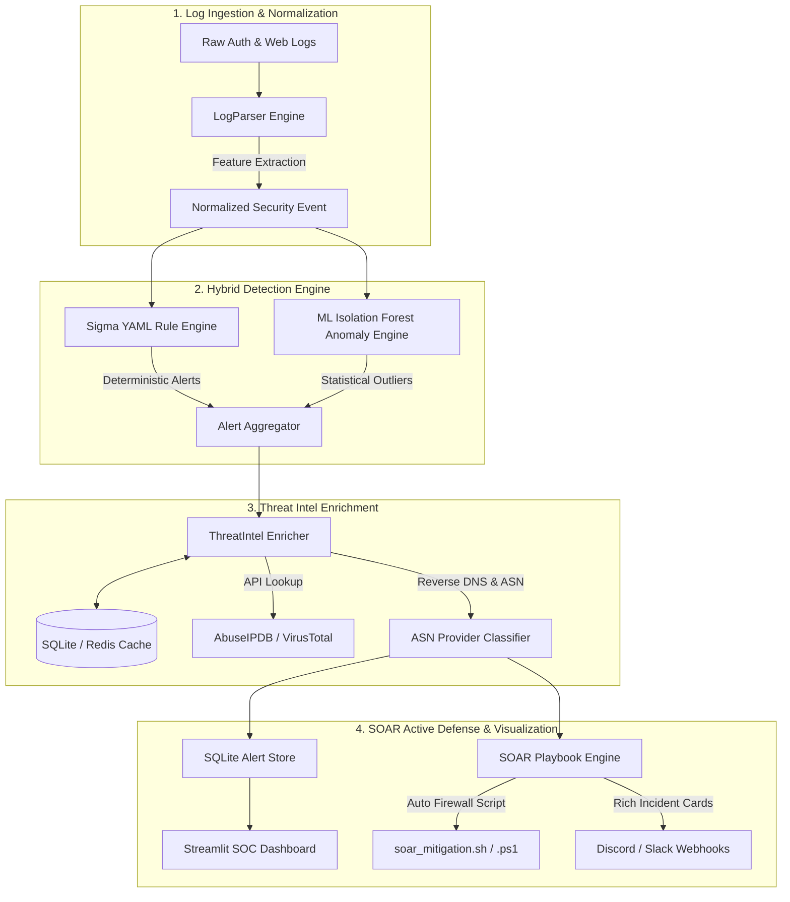

# 🛡️ SIEM Sentinel: Production-Grade Hybrid Detection Engine & SOAR Platform

[](https://opensource.org/licenses/MIT)
[](https://www.python.org/)
[](https://github.com/SigmaHQ/sigma)
[](https://www.docker.com/)

**SIEM Sentinel** is an enterprise-grade Security Information and Event Management (SIEM) log analyzer and active defense SOAR platform. Designed to upgrade generic regex log parsers into a **production-like security tool**, SIEM Sentinel combines **Sigma Rule Engine Detections**, **Unsupervised Machine Learning Anomaly Detection (Isolation Forest)**, **Automated Threat Intelligence Enrichment**, and **SOAR Active Defense Playbooks**.

---

## 📐 Architecture & Data-Flow Diagram



---

## 🔥 Key Enterprise Features

### 1. 🧬 Hybrid Detection Engine (Sigma YAML + ML Anomaly Detection)
* **Native Sigma Rule Engine**: Ingests industry-standard vendor-agnostic **Sigma YAML rules** (`rules/`) used across Splunk, QRadar, and Elastic.
* **Unsupervised Anomaly Detection**: Trains an **Isolation Forest** model (`scikit-learn`) on baseline log features (Shannon parameter entropy, payload length, request frequency velocity, byte size, off-hours execution, status codes) to catch zero-day and **"low and slow" attacks** that bypass static rules.

### 2. 🌐 Threat Intelligence Enrichment Pipeline
* **AbuseIPDB & VirusTotal Integration**: Automatically queries reputation scores, total abuse reports, ISP, and country code when alerts trigger.
* **Reverse DNS & ASN Tagging**: Classifies attacker IPs into `CLOUD_HOSTING` (DigitalOcean, AWS, Hetzner), `VPN_TOR_EXIT`, `RESIDENTIAL_ISP`, or `INTERNAL_NETWORK`.
* **Dual-Tier Caching (Redis + SQLite)**: Persistent local cache prevents API rate limit exhaustion during burst attacks.

### 3. ⚡ SOAR Active Defense Playbooks (Automated Incident Response)
* **Automated Firewall IP Null-Routing**: Automatically appends `iptables`, `ufw`, and Windows Firewall (`New-NetFirewallRule`) block commands to `soar_mitigation.sh` / `soar_mitigation.ps1` for critical alerts.
* **Discord & Slack Webhooks**: Dispatches rich, color-coded incident cards with MITRE technique tags, attacker ISP, AbuseIPDB confidence score, and quick action controls directly to SOC channels.

### 4. 🐳 Production Containerization
* Spin up the entire security pipeline, Redis cache, and Streamlit SOC dashboard in **30 seconds** with `docker compose up -d`.

---

## 🎯 MITRE ATT&CK Matrix Coverage

| MITRE ID | Technique Name | Detection Vector | Severity | Engine |
| :--- | :--- | :--- | :--- | :--- |
| **[T1110.001](https://attack.mitre.org/techniques/T1110/001/)** | Brute Force: Password Guessing | Fast SSH failed password burst detection | `HIGH` | Sigma Rule |
| **[T1190](https://attack.mitre.org/techniques/T1190/)** | Exploit Public-Facing Application | SQL Injection (`UNION SELECT`, `' OR '1'='1`) & Path Traversal (`../../etc/passwd`) | `CRITICAL` | Sigma Rule |
| **[T1505.003](https://attack.mitre.org/techniques/T1505/003/)** | Web Shell Persistence | Access attempts to webshell scripts (`c99.php`, `passthru`) | `CRITICAL` | Sigma Rule |
| **[T1078](https://attack.mitre.org/techniques/T1078/)** | Valid Accounts / Anomalous Login | Privileged logins outside business hours & high Shannon entropy payloads | `CRITICAL` | Isolation Forest ML |

---

## 🚀 Quickstart Guide

### Option A: Running with Docker Compose (Recommended)

1. **Clone the repository:**
   ```bash
   git clone https://github.com/your-username/siem-sentinel.git
   cd siem-sentinel
   ```

2. **Launch the stack:**
   ```bash
   docker compose up -d
   ```

3. **Access the Streamlit SOC Dashboard:**
   Open your browser and navigate to `http://localhost:8501`.

---

### Option B: Local Python Installation

1. **Install Python dependencies:**
   ```bash
   pip install -r requirements.txt
   ```

2. **Run the SIEM Pipeline Test & Attack Simulator:**
   ```bash
   python main.py
   ```

3. **Start the Streamlit SOC Analyst Dashboard:**
   ```bash
   streamlit run app.py
   ```

---

## 🎬 Attack Simulation & Live Demonstration

To simulate real-world attack traffic and observe real-time detection, threat enrichment, and SOAR response:

1. Open the **Streamlit Dashboard** (`http://localhost:8501`).
2. Click the **`🚀 Run Full Attack Simulation`** button in the left sidebar.
3. Observe:
   * Real-time alerts appearing in the **Alert Feed** tab with AbuseIPDB scores.
   * MITRE ATT&CK coverage charts updating in **Matrix Analytics**.
   * Statistical outliers isolated in the **ML Anomaly Inspector**.
   * Auto-generated mitigation scripts in **SOAR Active Defense Playbooks** (`soar_mitigation.sh`).

---

## ⚙️ Configuration (`config/settings.yaml`)

```yaml
threat_intelligence:
  abuseipdb:
    enabled: true
    confidence_threshold: 50
  cache:
    backend: "sqlite" # 'sqlite' or 'redis'

soar_playbooks:
  auto_block_ip:
    enabled: true
    min_severity: "CRITICAL"
    min_abuse_score: 75
    mitigation_script_output: "./soar_mitigation.sh"
```

---

## 📄 License
This project is licensed under the [MIT License](LICENSE).
